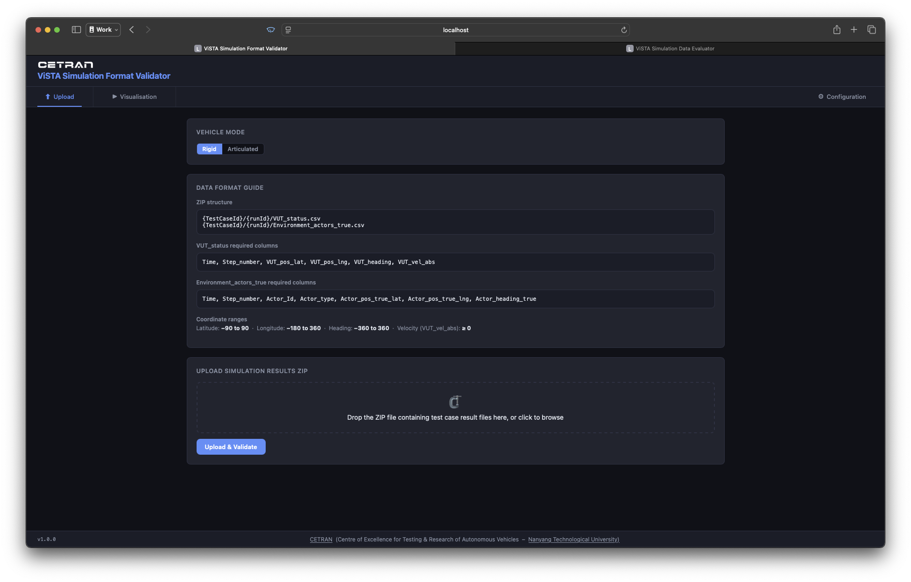
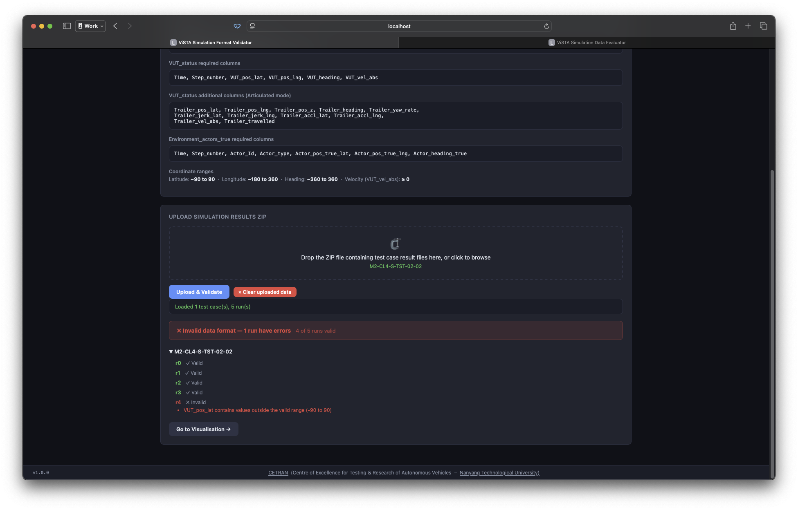
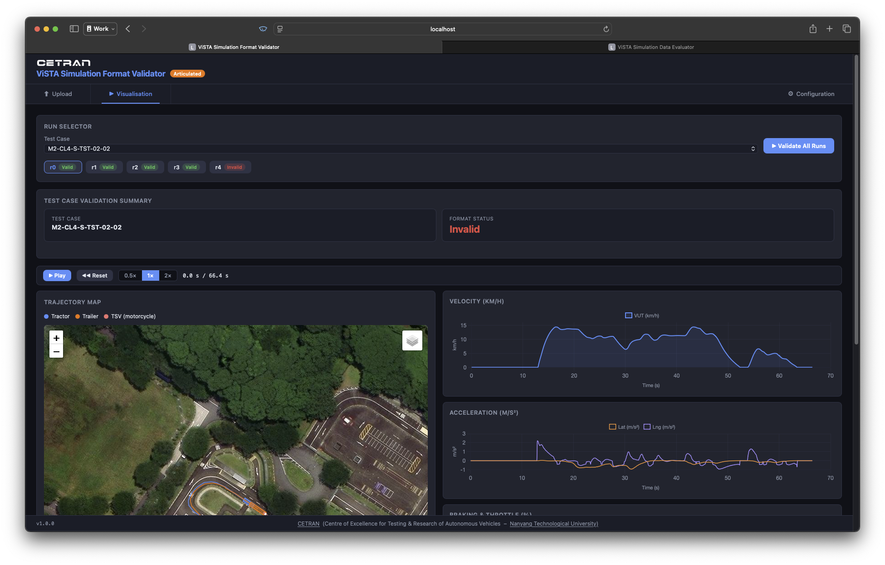
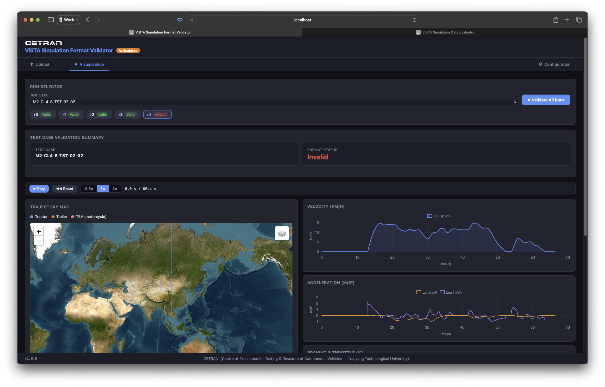
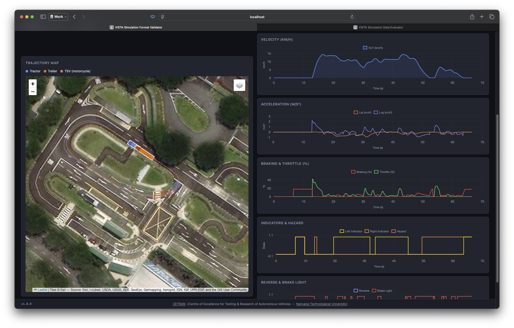
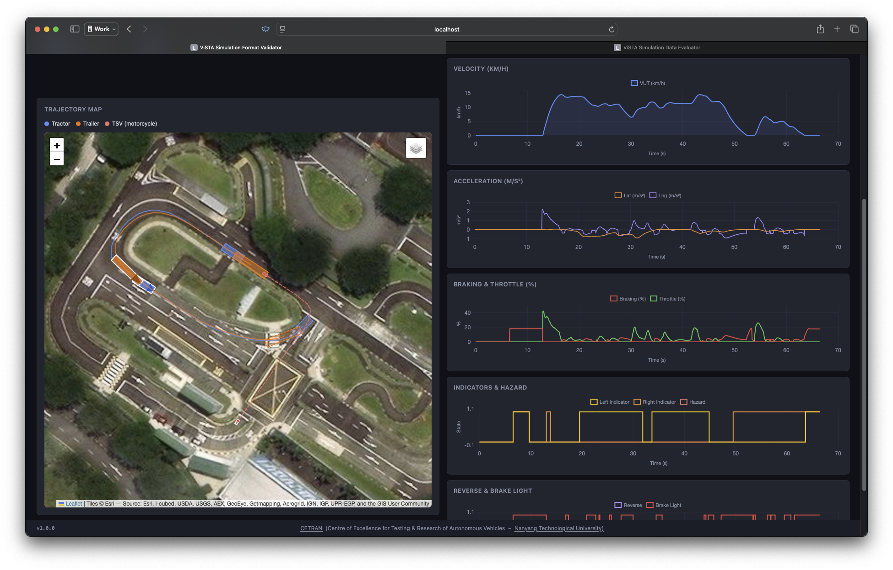

# ViSTA Simulation Format Validator

A local web tool for Autonomous Vehicle developers preparing for the **Milestone 2 simulation assessment**, part of the LTA Developmental AV Solutions Assessment Track (Public Roads). Upload your simulation output as a ZIP archive and get an instant format validation report before submission.

The tool validates files in the **[ViSTA (Virtual Simulation Testing and Assessment) format](https://github.com/cetran-sg/ViSTA-data-format)**, which is used in the Milestone 2 simulation evaluation. This version validates the **ground truth VUT and actor files** (`VUT_status.csv` and `Environment_actors_true.csv`) and visualises vehicle bounding boxes on an interactive map. Future versions will extend validation to simulation results containing perception output and traffic light output.

---

## Screenshots

| | |
|---|---|
|  |  |
| **Upload & format guide** — select Rigid or Articulated mode, review the required columns at a glance, then drop in a ZIP archive. | **Batch validation results** — every run in the archive is checked in one pass; expand a test case to see which runs failed and why. |
|  |  |
| **Trajectory visualisation (valid run)** — animated map playback alongside velocity and acceleration time-series charts. | **Trajectory visualisation (invalid run)** — an out-of-range `VUT_pos_lat` value snaps the map to a world view, making bad coordinate data immediately obvious. |
|  |  |
| **Articulated mode** — tractor and trailer are rendered as distinct bounding boxes (blue / orange), with braking, throttle, indicator and hazard charts alongside the map. | **Timeline playback** — scrubbing or playing the timeline advances the bounding boxes along the recorded trajectory in sync with the charts. |

---

## Features

- **Batch upload** — drop a ZIP archive containing multiple test cases and runs; all files are validated in one step
- **Instant feedback** — green / yellow / red banner shows whether your data is ready for submission, with per-run error and warning details
- **Trajectory visualisation** — interactive map with animated timeline scrubbing along with velocity, acceleration, braking/throttle, indicator and reverse/brake time-series charts
- **Articulated mode** — upload tractor-trailer data with `Trailer_*` columns; the trailer unit is validated separately and rendered as a distinct orange bounding box on the map
- **Configurable bounding boxes** — set vehicle length, width and CoG offsets for rigid body (VUT) or articulated (tractor + trailer) modes so map markers match your vehicle geometry
- **No internet connection required** — runs entirely on your local machine

---

## Prerequisites

| Requirement | Version |
|---|---|
| Python | 3.9 or later |
| pip | any recent version |

No other system dependencies are needed. The tool uses only standard Python packages (FastAPI, pandas, uvicorn).

---

## Installation

### macOS

```bash
# 1. Clone the repository
git clone https://github.com/cetran-sg/vista-simulation-format-validator.git
cd vista-simulation-format-validator

# 2. (Recommended) Create and activate a virtual environment
python3 -m venv .venv
source .venv/bin/activate

# 3. Install dependencies
pip install -r requirements.txt

# 4. Make the helper scripts executable
chmod +x start.sh stop.sh
```

### Linux

```bash
# 1. Clone the repository
git clone https://github.com/cetran-sg/vista-simulation-format-validator.git
cd vista-simulation-format-validator

# 2. (Recommended) Create and activate a virtual environment
python3 -m venv .venv
source .venv/bin/activate

# 3. Install dependencies
pip install -r requirements.txt

# 4. Make the helper scripts executable
chmod +x start.sh stop.sh
```

> **Note — system Python on Linux:** Some distributions (e.g. Ubuntu 22.04+) separate `python3` from `python3-venv`. If step 2 fails, run `sudo apt install python3-venv` first, then retry.

---

## Usage

### Start the server

```bash
./start.sh
```

The server starts on **http://localhost:8000**. Keep the terminal window open while you use the tool.

### Stop the server

```bash
./stop.sh
```

This sends a graceful kill signal to any process listening on port 8000.

### Manual start (without the helper script)

```bash
python3 -m uvicorn main:app --port 8000
```

---

## Data Format

Files must follow the **[ViSTA data format](https://github.com/cetran-sg/ViSTA-data-format)**. The sections below summarise the requirements validated by this tool.

### ZIP structure

Pack your simulation output into a ZIP archive with the following layout:

```
archive.zip
└── {TestCaseId}/
    └── {TestCaseId}_{runId}/
        ├── VUT_status.csv
        └── Environment_actors_true.csv
```

- `{TestCaseId}` — your test case identifier (e.g. `M2-CL4-S-TST-05-02`)
- `{runId}` — run identifier in the form `r0`, `r1`, `r2`, … (no upper limit on run count)
- `Environment_actors_true.csv` — required if the scenario contains actors; omit or leave empty otherwise

### `VUT_status.csv` — required columns

| Column | Description |
|---|---|
| `Time` | Absolute simulation timestamp (s); must be monotonically non-decreasing |
| `Step_number` | Integer simulation step index |
| `VUT_pos_lat` | VUT latitude (°); valid range −90 to 90 |
| `VUT_pos_lng` | VUT longitude (°); valid range −180 to 360 |
| `VUT_heading` | VUT heading (°); valid range −360 to 360 |
| `VUT_vel_abs` | VUT absolute speed (m/s); must be non-negative |

Additional columns (e.g. accelerations, braking level, indicators) are passed through to the visualisation charts if present but are not required for validation to pass.

### `VUT_status.csv` — additional columns for Articulated mode

Select **Articulated** mode before uploading to validate tractor-trailer data. The following columns are required in addition to the standard set above:

| Column | Description |
|---|---|
| `Trailer_pos_lat` | Trailer latitude (°); valid range −90 to 90 |
| `Trailer_pos_lng` | Trailer longitude (°); valid range −180 to 360 |
| `Trailer_pos_z` | Trailer altitude (m) |
| `Trailer_heading` | Trailer heading (°); valid range −360 to 360 |
| `Trailer_yaw_rate` | Trailer yaw rate (rad/s) |
| `Trailer_jerk_lat` | Trailer lateral jerk (m/s³) |
| `Trailer_jerk_lng` | Trailer longitudinal jerk (m/s³) |
| `Trailer_accl_lat` | Trailer lateral acceleration (m/s²) |
| `Trailer_accl_lng` | Trailer longitudinal acceleration (m/s²) |
| `Trailer_vel_abs` | Trailer absolute speed (m/s); must be non-negative |
| `Trailer_travelled` | Cumulative distance travelled (m) |

If a file containing `Trailer_pos_lat` data is uploaded in Rigid mode, the tool will offer to switch to Articulated mode automatically.

### `Environment_actors_true.csv` — required columns

| Column | Description |
|---|---|
| `Time` | Simulation timestamp (s) |
| `Step_number` | Integer simulation step index |
| `Actor_Id` | Unique identifier for each actor |
| `Actor_type` | Integer actor type code (see table below) |
| `Actor_pos_true_lat` | Actor latitude (°); valid range −90 to 90 |
| `Actor_pos_true_lng` | Actor longitude (°); valid range −180 to 360 |
| `Actor_heading_true` | Actor heading (°); valid range −360 to 360 |

### Actor type codes

| Code | Actor |
|---|---|
| 0 | Pedestrian / generic VRU |
| 1 | Personal Mobility Device (PMD / e-scooter) |
| 2 | Cyclist |
| 3 | Animal |
| 4 | Passenger vehicle |
| 5 | Motorcycle |
| 6 | Fire truck |
| 7 | Ambulance |
| 8 | Van |
| 9 | Trailer |
| 10 | Truck |
| 11 | Bus |
| 20 | Construction cone / road marker |
| 99 | Others / unclassified |

---

## Configuration

Open the **Configuration** tab to adjust the bounding-box parameters used for map rendering. The tab shows different inputs depending on the active vehicle mode.

### Rigid mode (default)

| Parameter | Default | Description |
|---|---|---|
| Length | 4.00 m | Bumper-to-bumper vehicle length |
| Width | 1.90 m | Edge-to-edge vehicle width |
| CoG to front bumper | 2.00 m | Distance from the CoG reference point to the front bumper |
| CoG to left edge | 0.95 m | Distance from the CoG reference point to the left edge |

### Articulated mode

Separate dimension inputs are shown for the **tractor** unit (defaults: 7.37 × 2.54 m, CoG 3.685 / 1.27 m) and the **trailer** unit (defaults: 12.19 × 2.44 m, CoG 6.095 / 1.22 m).

CoG offsets are independent of the overall dimensions — set them to match your specific vehicle geometry. Click **Commit Changes** to apply; the values take effect on the next run evaluation. **Reset to Defaults** restores the values above.

Default values can also be edited permanently in [`config.py`](config.py):

```python
# Rigid
VUT_DIM_LENGTH   = 4.00   # metres
VUT_DIM_WIDTH    = 1.90   # metres
VUT_COG_TO_FRONT = 2.00   # metres
VUT_COG_TO_LEFT  = 0.95   # metres

# Articulated — tractor
TRACTOR_DIM_LENGTH   = 7.37
TRACTOR_DIM_WIDTH    = 2.54
TRACTOR_COG_TO_FRONT = 3.685
TRACTOR_COG_TO_LEFT  = 1.27

# Articulated — trailer
TRAILER_DIM_LENGTH   = 12.19
TRAILER_DIM_WIDTH    = 2.44
TRAILER_COG_TO_FRONT = 6.095
TRAILER_COG_TO_LEFT  = 1.22
```

---

## Project Structure

```
vista-simulation-format-validator/
├── main.py          # FastAPI backend — routes and batch store
├── processor.py     # Data loading and trajectory extraction
├── validator.py     # Format validation logic
├── config.py        # Physical constants and actor type definitions
├── requirements.txt # Python dependencies
├── start.sh         # Start the server (macOS & Linux)
├── stop.sh          # Stop the server (macOS & Linux)
└── static/
    └── index.html   # Single-page frontend (vanilla JS + Leaflet + Chart.js)
```

---

## Disclaimer

This repository and the files within are intended as a reference for virtual simulation-based autonomous vehicle (AV) testing and related implementations/processes.

---

## Connect with us

- [CETRAN](https://cetran.sg) — Centre of Excellence for Testing & Research of Autonomous Vehicles — NTU
- [Nanyang Technological University](https://www.ntu.edu.sg), Singapore

---

## Citation

If you would like to cite the ViSTA data format, please cite from its original source on DR-NTU (Data):

```bibtex
@data{N9/HPLB28_2021,
  author    = {Cherian, Jim},
  publisher = {DR-NTU (Data)},
  title     = {{ViSTA Virtual Simulation Results Data Examples}},
  UNF       = {UNF:6:tr7v3W7fuFVR14F0IPtitQ==},
  year      = {2021},
  version   = {V1},
  doi       = {10.21979/N9/HPLB28},
  url       = {https://doi.org/10.21979/N9/HPLB28}
}
```

